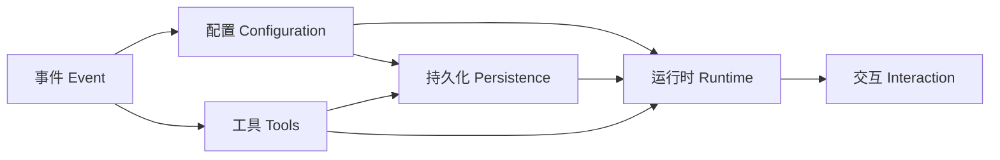

# 架构

playpen 是一个基于 ACP（Agent Client Protocol）的 coding agent 后端。

## 逻辑分层

从 Coding Agent 的完整视角出发，系统分为六层，依赖严格单向：



## 层职责

### 事件（Event）

全系统共享的核心类型，零依赖。其他所有层都依赖此层。

| 类型 | 职责 |
|---|---|
| `Event` | 统一事件模型：UserMessage / ModelMessage / FunctionCall / FunctionResult / TurnStop / StateUpdate 等 |
| `ContentBlock` | 消息内容块：Text / Resource / ResourceLink |
| `StopReason` | 结束原因：EndTurn / MaxTokens / Cancelled / Error 等 |
| `TokenUsage` | token 用量统计 |
| `format_content_block()` | ContentBlock → 可读文本 |

### 配置（Configuration）

多源 TOML 分层合并，模型提供商管理，AgentProfile 定义，Skill 发现。

| 概念 | 职责 |
|---|---|
| `Settings` | 用户配置：default_profile / sandbox / model_providers |
| `AppConfig` | 加载后的完整配置：Settings + 已编译的 sandbox Config |
| `Dirs` | 路径聚合：working_dir / config_data_dir / agents_dir |
| `ModelProvider` | LLM 提供商：base_url / api_key / models 列表 |
| `Model` | 模型规格：max_tokens / context_window / cost / reasoning_efforts |
| `ModelProfile` | Session 维度的模型选择：model / thinking_level / temperature / top_p |
| `AgentProfile` | Agent 配置：名称、描述、工作目录、model、system prompt、可用 skills、工具开关 |
| `Skill` | 技能包：SKILL.md 文件定义，含 metadata + markdown body |

### 持久化（Persistence）

Session 和事件的持久化存储，支持 rewind / replay。

| 概念 | 职责 |
|---|---|
| `SessionService` | session CRUD：create / get / rewind / delete / list |
| `Session` | session 视图：id / state / events |
| `Events` | 事件序列：append / all / len / by_role |
| `State` | 键值状态：get / set / entities |
| rewind | 按 event_id 回退到指定位置 |
| replay | 只读回放全部事件（不含 delta） |

### 工具（Tools）

Agent 操作外部世界的能力抽象。每个能力是一个 trait，可替换实现。可选沙箱包装做权限检查。

| 概念 | 职责 |
|---|---|
| `FileSystem` | read / edit / write / grep / find / move |
| `Terminal` | Shell 执行，流式 CommandOutput |
| `Fetcher` | HTTP 抓取 → Markdown |
| `Sandbox` | 路径/命令/域名权限裁决 |
| `Toolkit` | 聚合 FS + Terminal + Fetcher，提供原生/沙箱两种适配 |

### 运行时（Runtime）

Agent 运行时的核心编排。协调配置、事件、持久化、工具四层完成一次 prompt 的完整生命周期。

| 概念 | 职责 |
|---|---|
| `AgentRunner` | 一次 session 的执行视图：run(prompt) → Event 流 / rewind / replay / cancel |
| `AgentRunnerBuilder` | 工厂：create(profile) → 新 session 的 runner / resume(session_id) → 恢复已有 session |
| tool loop | 多轮 tool use：LLM 返回 tool_call → 执行工具 → 结果送回 LLM，直至 TurnStop |
| LLM client | 通过 rig-core 调用 OpenAI 兼容 API，处理 streaming / thinking / tool_call |
| cancel | 通过 CancellationToken 中断正在执行的 prompt |

### 交互（Interaction）

与外部客户端（编辑器）的协议适配层。将运行时的事件流映射为 ACP 协议消息。

| 概念 | 职责 |
|---|---|
| `EventMapper` | Event → ACP SessionUpdate 映射：实时流式 / replay 两种模式 |
| `AcpState` | ACP 运行时状态：runner 缓存、待应用配置、terminal 标记 |
| `handle_dispatch` | 请求分发：initialize / session/* / prompt / cancel |
| slash command | /rewind、/skill:{name} 解析与注入 |
| `serve(builder, transport)` | 启动 ACP server，通过 stdio 与编辑器通信 |

## 实现映射

逻辑层与当前 crate 的对应关系（crate 只是该层的一种实现）：

| 逻辑层 | Crate |
|---|---|
| 事件 | `playpen-content` |
| 配置 | `playpen-config`（Settings / Model）、`playpen-profile`（AgentProfile / Skill） |
| 持久化 | `playpen-session`（sea-orm + SQLite） |
| 工具 | `playpen-toolkit`（原生适配）、`playpen-sandbox`（macOS seatbelt） |
| 运行时 | `playpen-agent`（AgentRunner + LLM client） |
| 交互 | `playpen-acp`（ACP 协议适配）、`playpen`（CLI 入口） |

## 配置布局

```
~/.config/playpen/          ← 全局
├── conf.d/*.toml
├── settings.toml
└── profiles/{name}/
    ├── profile.toml
    └── instructions.md

~/.agents/skills/{name}/SKILL.md   ← 全局 Skills
{project}/.agents/skills/{name}/SKILL.md   ← 项目 Skills
{project}/.playpen.toml     ← 项目配置

~/.cache/playpen/sessions.db ← Session SQLite
```
